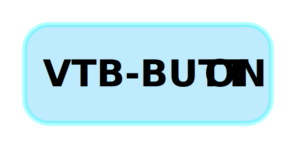

<div align="center">
    
</div>

<h1 align="center">
  VTB BUTTON
</h1>


## 😀 关于

VTB BUTTON 是用于快速架设虚拟主播直播音频剪辑播放按钮的项目，你可以自定义页面的色彩搭配，顶部导航栏的链接，以及介绍内容。

## 🚀 开发环境

* Node.js v14.16.0
* npm v6.14.11

## 📄 使用文档

简略版（详细版编撰中）：

1. 安装开发所需环境，前往Release界面下载发布版本或者克隆这个仓库

2. 在项目根目录打开命令行，运行以下命令安装依赖和 `gatsby-cli`

    ```shell
    npm install
    npm install -g gatsby-cli
    ```

3. 修改 `/src/options.js` 来进行界面自定义（如果使用背景图片，请放置于 `static` 路径下，推荐放置在 `images` 文件夹下，然后路径填写为 `images/图片名.后缀`）

4. 将音频剪辑放到 `/static/audios` 文件夹下，修改 `/src/audioInfo.js` 文件，参照已有的示例修改、添加和删除配置信息

5. 替换 `static/images/icon.png` ，这个文件将作为网站的 `favicon` 以及 PWA 应用的图标 

6. 调试模式：调试模式下修改 `src/options.js` 和 `src/audioInfo.js` 的内容将会实时反馈到浏览器中的页面内，要开启调试模式，请运行如下指令

    ``` shell
    npm run clean
    npm run develop
    ```

7. 生成部署文件：若要生成部属用的静态文件，请运行如下指令

    ``` shell
    npm run clean
    npm run build
    ```

    运行后生成的 `public` 目录即为可用于生产环境部署的静态页面文件，可以使用任何静态网页服务器提供服务

    本项目可以配合 `Github Action` 与 `Github Pages` ，做到自动化构建与部署（详细文档编撰中）

## ❤️ 许可证

本项目使用 [GNU General Public License Version 3.0](./LICENCE) 许可证开源